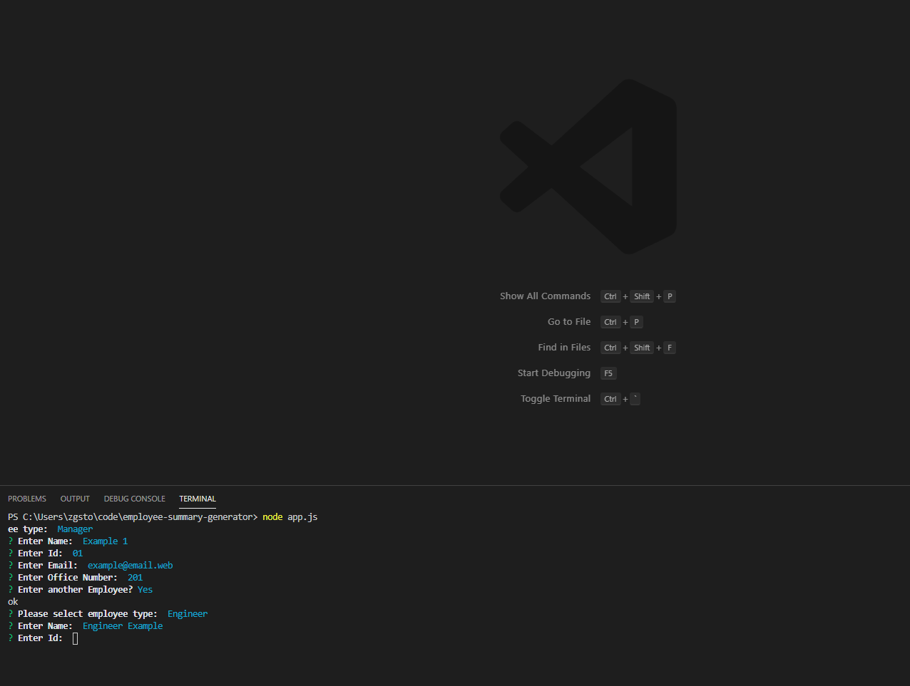
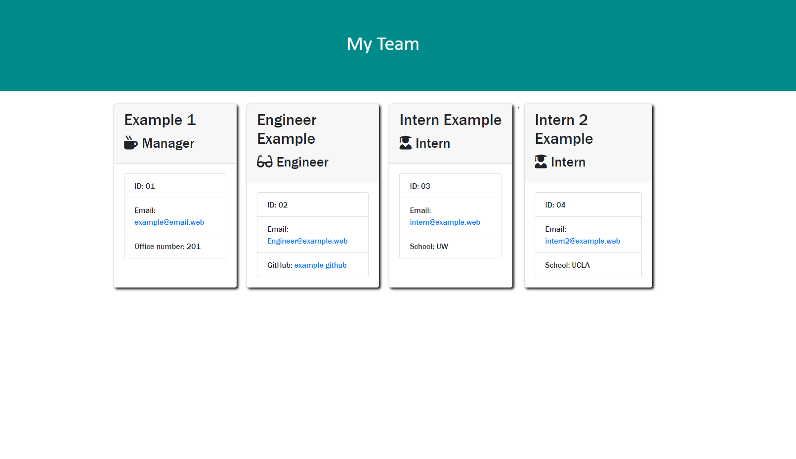

# Employee Summary Generator

## Description: 
A CLI application allowing the user to enter the members of a work team and generate a `.html` document displaying all team information. The app adjust the questions based on the type of employee entered and the output page has role-specific display icons and information. 

## Installation: 

* `npm i` to install required nodes

## Questions:
* GitHub Profile:  [the-medium-place](https://github.com/the-medium-place)
* Email: <zgstowell@gmail.com>

